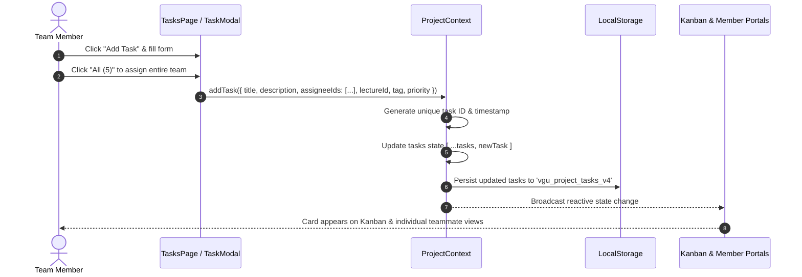
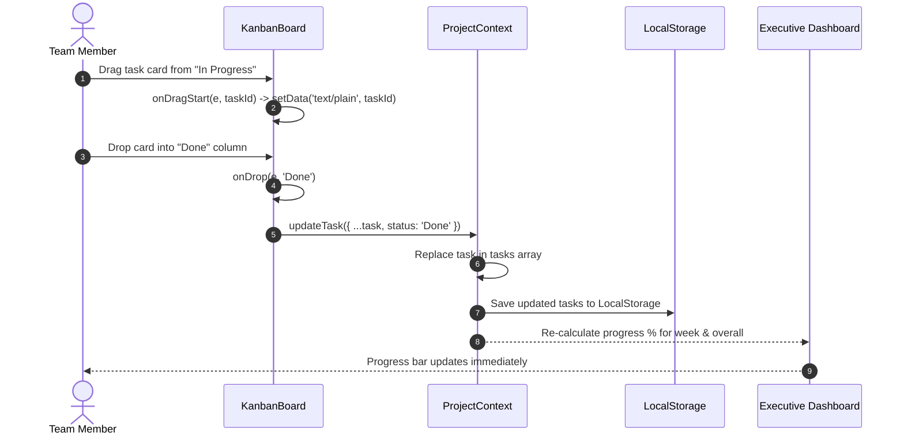
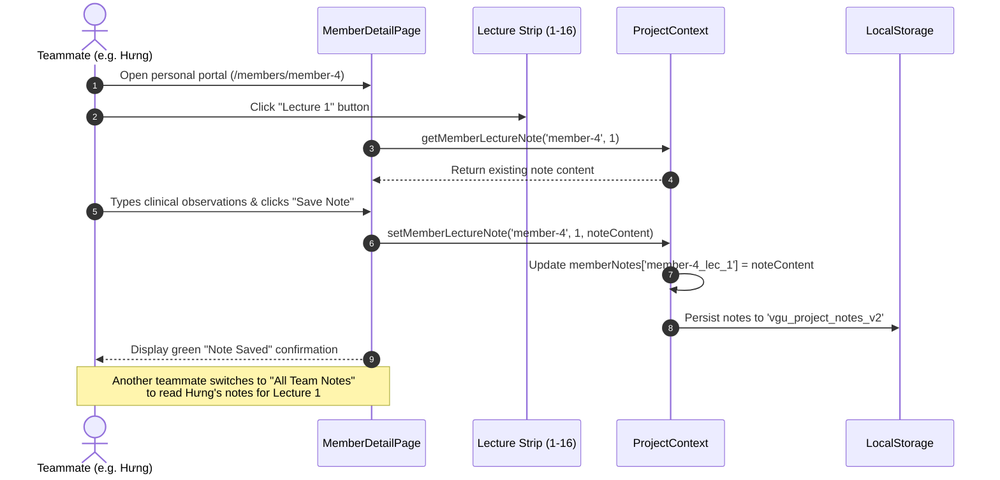
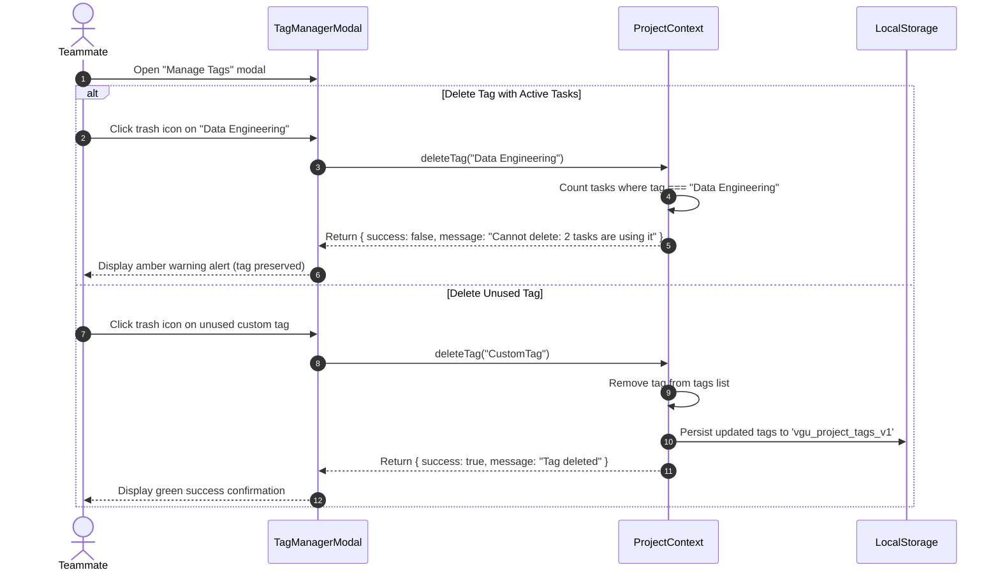
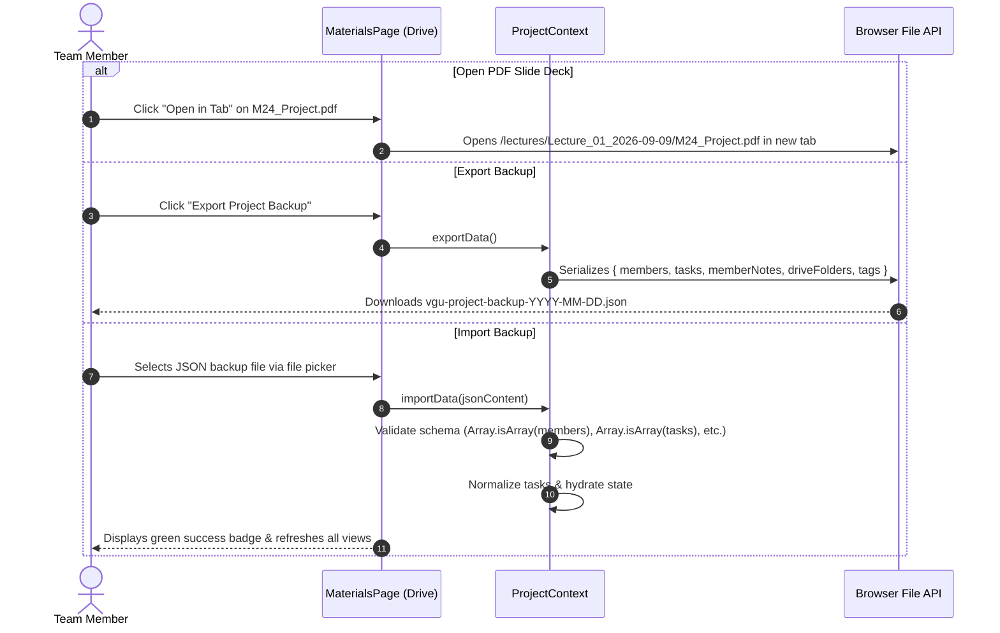

# VGU CS AI Project Hub: Small Multimodal Models for Clinical Diagnosis

A unified, collaborative research and project management portal built for **Dr. Tran Duc Khanh's 10-ECTS Project in Computer Science** (Winter Semester 2026-2027) at the **Vietnamese-German University (VGU)**.

- **Institution:** Vietnamese-German University (VGU)
- **Course:** Project in Computer Science (10 ECTS Credits)
- **Academic Supervisor:** Dr. Tran Duc Khanh
- **Teaching Assistant:** Le Viet Tin
- **Project Topic:** Small Multimodal Models for Clinical Diagnosis
- **Core Dataset:** PubMed MultiCaRe Dataset (93k clinical cases, 130k medical images)
- **Live Local Server:** `http://localhost:3000`

---

## Table of Contents

1. [Project Overview & Scientific Context](#1-project-overview--scientific-context)
2. [Key Architecture & Technology Stack](#2-key-architecture--technology-stack)
3. [Taste Design System & UI Principles](#3-taste-design-system--ui-principles)
4. [Complete Page & Feature Guide](#4-complete-page--feature-guide)
   - [Executive Dashboard (`/`)](#executive-dashboard-)
   - [Central Task Hub & Kanban Board (`/tasks`)](#central-task-hub--kanban-board-tasks)
   - [Team Roster & Teammate Portals (`/members` & `/members/[memberId]`)](#team-roster--teammate-portals-members--membersmemberid)
   - [Curriculum Hub & Lecture Dossiers (`/lectures` & `/lectures/[week]`)](#curriculum-hub--lecture-dossiers-lectures--lecturesweek)
   - [Course Drive Explorer & Materials Hub (`/materials`)](#course-drive-explorer--materials-hub-materials)
5. [Codebase Directory Structure](#5-codebase-directory-structure)
6. [Data Flow & State Architecture](#6-data-flow--state-architecture)
7. [Feature Sequence Diagrams](#7-feature-sequence-diagrams)
   - [Sequence 1: Task Creation & Multi-Assignee Flow](#sequence-1-task-creation--multi-assignee-flow)
   - [Sequence 2: Kanban Drag-and-Drop Status Update Flow](#sequence-2-kanban-drag-and-drop-status-update-flow)
   - [Sequence 3: Lecture Note Logging & Cross-Team Aggregation Flow](#sequence-3-lecture-note-logging--cross-team-aggregation-flow)
   - [Sequence 4: Tag Management & Orphan Prevention Flow](#sequence-4-tag-management--orphan-prevention-flow)
   - [Sequence 5: Course Drive Navigation & Backup Export/Import Flow](#sequence-5-course-drive-navigation--backup-exportimport-flow)
8. [Installation & Local Development](#8-installation--local-development)
9. [Production Build & Vercel Deployment](#9-production-build--vercel-deployment)
10. [Team Roster](#10-team-roster)

---

## 1. Project Overview & Scientific Context

This project focuses on building a privacy-preserving, locally deployable clinical decision-support system powered by **Small Multimodal Models (SMMs)**. The goal is to assist clinicians in diagnosing tropical and infectious diseases (e.g., Dengue, Malaria, Tuberculosis, Melioidosis) through multimodal analysis (clinical notes paired with radiology images, skin lesions, and lab reports).

### The Three-Tier Technical Architecture

```
+-----------------------------------------------------------------------------------+
|                            CLINICAL CONSULTATION QUERY                            |
|             (Patient Narrative + Clinical Photos / Radiology X-rays / CT)          |
+-----------------------------------------------------------------------------------+
                                         |
                                         v
+-----------------------------------------------------------------------------------+
| LEVEL 1: GROUNDED KNOWLEDGE RETRIEVAL (LightRAG / Knowledge Graph)                |
| - Dual-level graph indexing: high-level entity relations & low-level passages     |
| - Grounding citations against infectious disease clinical practice guidelines    |
+-----------------------------------------------------------------------------------+
                                         |
                                         v
+-----------------------------------------------------------------------------------+
| LEVEL 2: PARAMETER-EFFICIENT FINE-TUNING (PEFT / 4-bit QLoRA)                     |
| - Small Multimodal Vision-Language Backbones (LLaVA, Gemma-2-Vision, PaliGemma)   |
| - 4-bit NormalFloat quantization with bitsandbytes for consumer GPU inference     |
| - Supervised Fine-Tuning (SFT) on stratified MultiCaRe medical cases              |
+-----------------------------------------------------------------------------------+
                                         |
                                         v
+-----------------------------------------------------------------------------------+
| LEVEL 3: MULTI-AGENT CLINICAL DEBATE & CONSENSUS (MedAgents)                      |
| - Multi-specialist debate: Radiologist, Pathologist, Infectious Disease Physician  |
| - Consensus voting mechanism yielding Top-5 differential diagnoses + rationale    |
+-----------------------------------------------------------------------------------+
```

---

## 2. Key Architecture & Technology Stack

| Layer | Technology | Rationale |
|---|---|---|
| **Framework** | Next.js 15.5 (App Router) | High-performance server/client hybrid rendering, dynamic route segments, and zero-config deployment. |
| **Language** | TypeScript 5 | Strict static typing across tasks, members, curriculum sessions, and drive artifacts. |
| **Styling** | Tailwind CSS 3.4 + CSS Variables | Bento-grid aesthetics, dark/light theme switching, custom micro-interactions. |
| **Icons** | Lucide React | Modern, consistent icon library for clinical and engineering dashboards. |
| **State Management** | React Context + LocalStorage | Zero-setup client persistence with multi-version storage auto-migration (`vgu_project_*`). |
| **Drag & Drop** | HTML5 Native Drag & Drop API | Fluid card dragging across Kanban columns without heavy third-party bundle weight. |
| **Package Manager** | pnpm | Fast, deterministic, space-efficient dependency resolution. |

---

## 3. Taste Design System & UI Principles

- **Bento Grid Architecture:** Every page organizes content into high-density, structured cards (`bento-card`) with rounded corners (`rounded-2xl`), subtle borders (`var(--border-subtle)`), and elevated surfaces.
- **Theme Dual-Engine (Light & Pitch-Black):** Uses data attributes (`data-theme="light"` / `data-theme="dark"`). An inline `<script>` in the document `<head>` reads `localStorage` before the first paint to guarantee zero Flash of Unstyled Content (FOUC).
- **Domain Color Palette (Jewel Tones):**
  - Blue (`#2563eb`): Level 1 Graph RAG & core architectural actions.
  - Purple (`#7c3aed`): Level 2 PEFT / QLoRA fine-tuning.
  - Emerald (`#059669`): Level 3 MedAgents consensus & completed deliverables.
  - Amber (`#d97706`): MultiCaRe clinical data pipelines & active indicators.
  - Rose (`#e11d48`): High-priority clinical alerts & critical bug tracking.
- **Strict Typography:** Zero em-dashes (`—`) or en-dashes (`–`) across all text strings; standard hyphens (`-`) are used universally.
- **Vietnamese Naming Convention Support:** Automatically extracts the given name (the final word of full Vietnamese names via `getMemberShortName`) for human-readable badges, buttons, and avatars (e.g., `Phan Thành Hưng` -> `Hưng`).
- **Button-Only Navigation:** Navigation controls (such as the 16-session lecture dial) rely strictly on explicit button clicks to prevent accidental trigger loops from mouse wheel scrolling or touch gestures.

---

## 4. Complete Page & Feature Guide

### Executive Dashboard (`/`)
- **Course Metric Badges:** Real-time visibility into course parameters (10 ECTS, 4 weekly hours, active lecture session indicator, 30% continuous / 70% final examination split).
- **Interactive Weekly Progress Widget:**
  - Formula:
    $$\text{Progress \%} = \left(\frac{\text{Done Tasks in Selected Week}}{\text{Total Assigned Tasks in Selected Week}}\right) \times 100\%$$
  - Cyclical navigation buttons (`<`, `W1`..`W16`, `All`, `>`) allow toggling between week-specific deliverables and total project velocity.
  - Visual breakdown displaying each teammate's individual completion percentage for the selected lecture scope.
- **Dynamic Course Hub:** Shortcuts that adapt dynamically based on the current active lecture (e.g., active lecture briefing, direct lecture folder link).
- **Three Methodological Pillars:** Interactive overview cards detailing Level 1 (LightRAG), Level 2 (PEFT), and Level 3 (MedAgents).
- **MultiCaRe Dataset Telemetry:** Key statistics on the 93,000 cases and 130,000 images comprising the core clinical multimodal benchmark.

---

### Central Task Hub & Kanban Board (`/tasks`)
- **Scoped Lecture Dial:** Minimal dial supporting instant switching between `All ({tasks.length})` and individual lecture sessions (`Lecture 1` through `Lecture 16`).
- **Dual View Modes:**
  - **Kanban Board View:** Four workflow columns (`Backlog`, `In Progress`, `Review`, `Done`) with native HTML5 drag-and-drop support.
  - **Tabular List View:** High-density table featuring status pickers, priority indicators, and inline action buttons.
- **Multi-Assignee Support:**
  - Tasks can be assigned to 1 teammate, multiple teammates, or the entire team via the 1-click `All ({members.length})` shortcut.
  - Team assignment displays distinct multi-member avatars and Vietnamese short names.
- **Dynamic Tag Manager Modal:**
  - Allows creating custom project tags on the fly.
  - Includes a deletion safety check that prevents deleting tags that currently have active tasks attached, preventing orphaned tasks.
- **Search & Filters:** Real-time search by task title or description, filtered by Assignee, Category Tag, or Priority level.

---

### Team Roster & Teammate Portals (`/members` & `/members/[memberId]`)
- **Central Team Directory (`/members`):**
  - Displays cards for all 5 team members with student IDs, roles, contact emails, and assigned technical pillars.
  - Global lecture progress switcher (`Progress Scope: [<] [All 16 Weeks / Week 1] [>]`) to synchronize all teammate completion bars.
  - Individual mini-navigators on each card to inspect a specific member's velocity in any week.
  - Add / Edit Teammate modal with automatic initials generation and customizable avatar accents.
- **Personal Teammate Portal (`/members/[memberId]`):**
  - Dedicated personal dashboard for each team member.
  - **Filtered Sprint Deliverables:** Tasks specifically assigned to that member for the selected lecture or all lectures.
  - **Lecture Notes Logging Engine:**
    - **My Notes View:** Rich markdown text area where the member records observations, data insights, and blockers for each lecture (1 to 16).
    - **All Team Notes Aggregator View:** Cross-member reading room where any teammate can read the notes logged by all other members for the chosen lecture session.

---

### Curriculum Hub & Lecture Dossiers (`/lectures` & `/lectures/[week]`)
- **Curriculum Directory (`/lectures`):**
  - Full 16-week timeline partitioned into 5 curriculum phases: Data, Modeling, Agents, Evaluation, and Delivery.
  - Phase filter pills (`All`, `Data`, `Modeling`, `Agents`, `Evaluation`, `Delivery`).
  - Distinguishes between completed/active sessions and upcoming sessions with friendly "Not Yet Conducted" placeholders.
- **Lecture Detail Dossier (`/lectures/[week]`):**
  - **Lecture 1 Comprehensive Digest:** Orientation briefing, Dr. Khanh's course syllabus, and TA Le Viet Tin's MultiCaRe orientation.
  - **Slide Deck Downloads & Viewers:** Direct links opening `M24_Project.pdf`, `Project Sharing_Mr Tin.pdf`, and `Lecture_01_Summary.html` in new tabs (`target="_blank"` with `rel="noopener noreferrer"`).
  - **Live Action Items Tracker:** Integrated checklist component synced directly with the central task engine. Updates made here immediately reflect on the Kanban board and teammate portals.
  - **Recommended Literature Library:** Quick-reference cards linking directly to arXiv papers (scoping review, LightRAG, QLoRA, MedAgents).

---

### Course Drive Explorer & Materials Hub (`/materials`)
- **Drive-Style Folder System:**
  - Chronological lecture folders (`Lecture_01_2026-09-09`, etc.) storing official course slide decks, briefs, and code notebooks.
  - Breadcrumb navigation (`All Folders > Lecture_01_2026-09-09`) with folder creation, rename, and deletion capabilities.
  - Grid card view and high-density tabular list view.
  - Instant file opening in a new browser tab with direct download links.
- **Project Backup Engine:**
  - **Export Project Backup (JSON):** Downloads a complete JSON snapshot containing all tasks, members, lecture notes, drive folders, and tags.
  - **Import Project Backup (JSON):** Restores data from a previously exported backup file with schema validation and error handling.

---

## 5. Codebase Directory Structure

```
project-hub/
├── app/                                # Next.js 15 App Router pages & layouts
│   ├── globals.css                     # Taste design system CSS variables & bento styles
│   ├── layout.tsx                      # Root HTML layout, FOUC prevention script, ProjectProvider
│   ├── page.tsx                        # Executive Dashboard with Weekly Progress widget
│   ├── lectures/
│   │   ├── page.tsx                    # 16-week curriculum directory & phase filters
│   │   └── [week]/
│   │       └── page.tsx                # Lecture Dossier (Lecture 1 summary, slides, task tracker)
│   ├── materials/
│   │   └── page.tsx                    # Google Drive explorer, file manager & backup tool
│   ├── members/
│   │   ├── page.tsx                    # Team roster directory & progress scope switcher
│   │   └── [memberId]/
│   │       └── page.tsx                # Personal member portal, task checklist & lecture note engine
│   └── tasks/
│       └── page.tsx                    # Central task hub, Kanban board & search/filter bar
│
├── components/                         # Reusable React components
│   ├── Footer.tsx                      # Global footer with university credits
│   ├── KanbanBoard.tsx                 # HTML5 drag-and-drop 4-column task board
│   ├── LectureDial.tsx                 # Button-only cyclical lecture session navigator (1-16)
│   ├── LectureTaskTracker.tsx          # Synced lecture action deliverable tracker
│   ├── Navbar.tsx                      # Global navigation header & dark/light theme toggle
│   └── TagManagerModal.tsx             # Modal to add/delete tags with integrity guard
│
├── context/                            # Application state management
│   └── ProjectContext.tsx              # Central React Context, LocalStorage sync & auto-migration
│
├── data/                               # Initial datasets and seed values
│   ├── driveData.ts                    # Initial drive folder hierarchy & lecture file metadata
│   └── initialData.ts                  # Seed team members, initial tasks & 16 lecture sessions
│
├── public/                             # Public static assets & course documents
│   └── lectures/
│       └── Lecture_01_2026-09-09/      # Official Lecture 1 files
│           ├── Lecture_01_Summary.html # Standalone interactive HTML dossier
│           ├── M24_Project.pdf         # Dr. Tran Duc Khanh course syllabus
│           └── Project Sharing_Mr Tin.pdf # TA Le Viet Tin orientation slide deck
│
├── types/                              # TypeScript interfaces & domain models
│   └── index.ts                        # Member, Task, LectureSession, DriveFolder, etc.
│
├── .gitignore                          # Git ignore rules (node_modules, .next, .DS_Store)
├── next.config.mjs                     # Next.js configuration
├── package.json                        # Dependencies, scripts & engine requirements
├── pnpm-lock.yaml                      # Deterministic lockfile
├── postcss.config.mjs                  # PostCSS plugins (Tailwind CSS, Autoprefixer)
├── README.md                           # Comprehensive documentation (this file)
└── tsconfig.json                       # Strict TypeScript compiler options
```

---

## 6. Data Flow & State Architecture

All dynamic application data flows through a centralized, reactive React Context (`ProjectContext`):

```
                        +----------------------------+
                        |   Browser LocalStorage     |
                        | (vgu_project_tasks_v4, etc)|
                        +----------------------------+
                                      ^
                         Auto-save    |   Hydration on load
                                      v
                        +----------------------------+
                        |       ProjectContext       |
                        |  - members: Member[]       |
                        |  - tasks: Task[]           |
                        |  - memberNotes: Record<>   |
                        |  - driveFolders: Folder[]  |
                        |  - tags: string[]          |
                        |  - theme: 'light' | 'dark' |
                        +----------------------------+
                                      |
         +----------------------------+----------------------------+
         |                            |                            |
         v                            v                            v
+------------------+         +------------------+         +------------------+
| Executive Dash   |         | Central Task Hub |         | Teammate Portals |
| - Weekly %       |         | - Kanban Board   |         | - Member Tasks   |
| - Member Bars    |         | - Lecture Dial   |         | - Lecture Notes  |
+------------------+         +------------------+         +------------------+
         |                            |                            |
         v                            v                            v
+------------------+         +------------------+         +------------------+
| Curriculum Hub   |         | Course Drive Hub |         | Backup Engine    |
| - Action Items   |         | - File Explorer  |         | - JSON Export    |
| - Slide Viewers  |         | - Direct PDF Tab |         | - JSON Import    |
+------------------+         +------------------+         +------------------+
```

### Storage Auto-Migration & Versioning

To ensure clients never get stuck with outdated schema or stale mock data across updates, `ProjectContext` uses versioned storage keys:

- `vgu_project_members_v2`
- `vgu_project_tasks_v4`
- `vgu_project_notes_v2`
- `vgu_project_drive_v1`
- `vgu_project_tags_v1`
- `vgu_project_theme_preference`

When the application loads, `ProjectContext` checks for `vgu_project_tasks_v4`. If absent, it automatically seeds the newest `INITIAL_TASKS` and purges legacy keys (`v3`, `v2`, `v1`).

---

## 7. Feature Sequence Diagrams

### Sequence 1: Task Creation & Multi-Assignee Flow



---

### Sequence 2: Kanban Drag-and-Drop Status Update Flow



---

### Sequence 3: Lecture Note Logging & Cross-Team Aggregation Flow



---

### Sequence 4: Tag Management & Orphan Prevention Flow



---

### Sequence 5: Course Drive Navigation & Backup Export/Import Flow



---

## 8. Installation & Local Development

### Prerequisites
- **Node.js:** v18.17.0 or higher
- **Package Manager:** `pnpm` (recommended), `npm`, or `yarn`

### Setup Steps

```bash
# 1. Navigate to the project directory
cd "Project_Dr. Tran Duc Khanh/project-hub"

# 2. Install dependencies
pnpm install

# 3. Start the Next.js development server
pnpm dev

# 4. Open in browser
# Navigate to http://localhost:3000
```

---

## 9. Production Build & Vercel Deployment

### Testing the Production Build Locally

```bash
# Compile and optimize production build
pnpm build

# Run the local production server
pnpm start
# Server listens on http://localhost:3000
```

### Deploying to Vercel

The application is architected for zero-configuration deployment on **Vercel**:

#### Method 1: Using the Vercel CLI (Instant)
```bash
# From within the project-hub directory
npx vercel
```
Follow the CLI prompts to link the project and deploy within 60 seconds.

#### Method 2: Via GitHub Repository
1. Initialize Git and commit the repository:
   ```bash
   git add .
   git commit -m "feat: complete VGU CS AI Project Hub with Week 1 tasks"
   ```
2. Push to your GitHub repository:
   ```bash
   git remote add origin https://github.com/<your-username>/<your-repo>.git
   git branch -M main
   git push -u origin main
   ```
3. Import the repository in your [Vercel Dashboard](https://vercel.com/new).
4. Vercel automatically detects Next.js, sets build command `next build`, output directory `.next`, and deploys.

---

## 10. Team Roster

| Student ID | Full Name | Given Name | Primary Role | Assigned Domain |
|---|---|---|---|---|
| **10423057** | Lê Quang Minh Khoa | **Khoa** | Team Leader & ML Architect | System Architecture & PyTorch |
| **10423063** | Nguyễn Võ Minh Khôi | **Khôi** | Clinical Data & Pipeline Engineer | MultiCaRe Dataset Curation & ETL |
| **10423054** | Nguyễn Đức Khang | **Khang** | Vision-Language & PEFT Engineer | QLoRA 4-bit Quantization & LLaVA |
| **10423051** | Phan Thành Hưng | **Hưng** | RAG & Knowledge Graph Specialist | LightRAG Dual-level Graph Grounding |
| **10423110** | Dương Quý Trang | **Trang** | Multi-Agent & Evaluation Engineer | MedAgents Collaborative Clinical Debate |

---

*Academic Winter Semester 2026-2027 | Department of Computer Science | Vietnamese-German University (VGU)*
