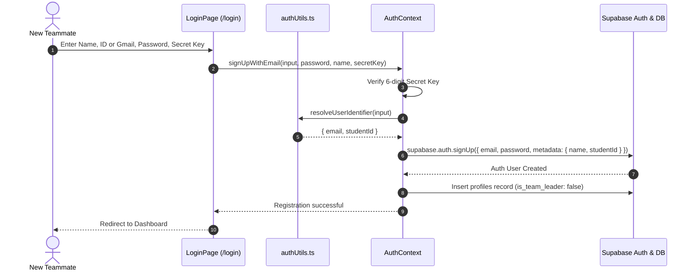
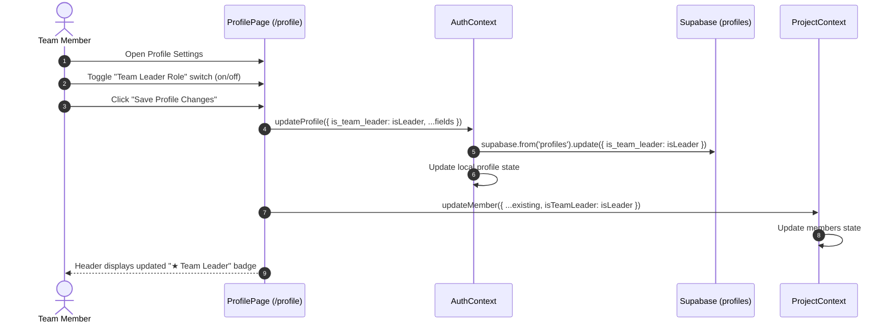
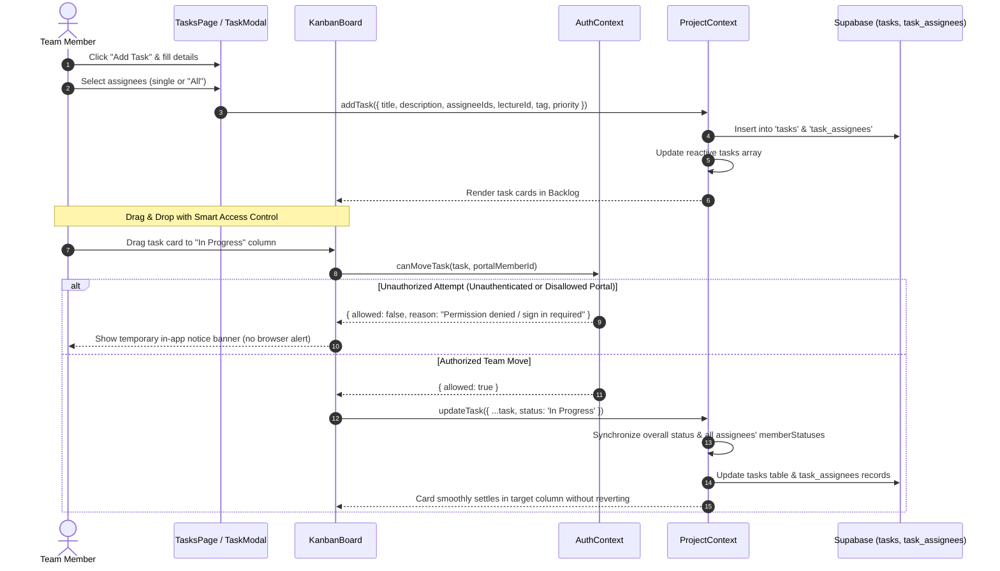
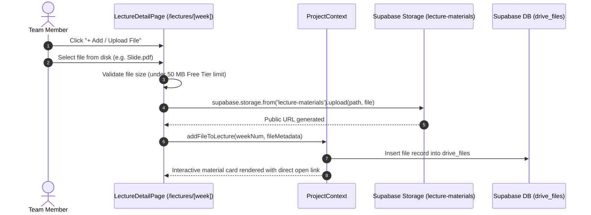
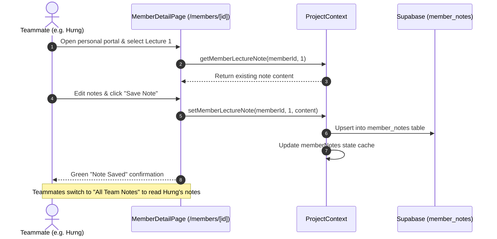

# VGU CS AI Project Hub: Small Multimodal Models for Clinical Diagnosis

A unified, collaborative research, curriculum dossier, and project management portal built for **Dr. Tran Duc Khanh's 10-ECTS Project in Computer Science** (Winter Semester 2026-2027) at the **Vietnamese-German University (VGU)**.

- **Institution:** Vietnamese-German University (VGU)
- **Course:** Project in Computer Science (10 ECTS Credits)
- **Academic Supervisor:** Dr. Tran Duc Khanh
- **Teaching Assistant:** Le Viet Tin
- **Project Topic:** Small Multimodal Models for Clinical Diagnosis
- **Core Dataset:** PubMed MultiCaRe Dataset (93k clinical cases, 130k medical images)
- **Live Local Server:** `http://localhost:3000`
- **GitHub Repository:** `https://github.com/KiwisCodes/VGU-Project-Course.git`

---

## Table of Contents

1. [Project Overview & Scientific Context](#1-project-overview--scientific-context)
2. [Key Architecture & Technology Stack](#2-key-architecture--technology-stack)
3. [Taste Design System & UI Principles](#3-taste-design-system--ui-principles)
4. [Complete Page & Feature Guide](#4-complete-page--feature-guide)
   - [Executive Dashboard (`/`)](#executive-dashboard-)
   - [Central Task Hub & Kanban Board (`/tasks`)](#central-task-hub--kanban-board-tasks)
   - [Curriculum Hub & All 16 Unlocked Lecture Dossiers (`/lectures` & `/lectures/[week]`)](#curriculum-hub--all-16-unlocked-lecture-dossiers-lectures--lecturesweek)
   - [Team Roster & Teammate Portals (`/members` & `/members/[memberId]`)](#team-roster--teammate-portals-members--membersmemberid)
   - [Course Drive Explorer & Materials Hub (`/materials`)](#course-drive-explorer--materials-hub-materials)
   - [Profile Settings & Leadership Designation (`/profile`)](#profile-settings--leadership-designation-profile)
   - [Authentication & Identity Resolution (`/login`)](#authentication--identity-resolution-login)
5. [Codebase Directory Structure](#5-codebase-directory-structure)
6. [Data Flow & State Architecture (Supabase + Local Fallback)](#6-data-flow--state-architecture-supabase--local-fallback)
7. [Security, Route Protection & Dynamic Resolution](#7-security-route-protection--dynamic-resolution)
8. [Feature Sequence Diagrams](#8-feature-sequence-diagrams)
   - [Sequence 1: Dynamic Identity Resolution & Registration Flow](#sequence-1-dynamic-identity-resolution--registration-flow)
   - [Sequence 2: Team Leader Designation & Profile Update Flow](#sequence-2-team-leader-designation--profile-update-flow)
   - [Sequence 3: Task Creation & Multi-Assignee Kanban Flow](#sequence-3-task-creation--multi-assignee-kanban-flow)
   - [Sequence 4: In-Lecture Material Upload & Storage Flow](#sequence-4-in-lecture-material-upload--storage-flow)
   - [Sequence 5: Lecture Note Logging & Cross-Team Aggregation Flow](#sequence-5-lecture-note-logging--cross-team-aggregation-flow)
9. [Installation & Local Development](#9-installation--local-development)
10. [Production Build & Vercel Deployment](#10-production-build--vercel-deployment)
11. [Team Roster & Governance](#11-team-roster--governance)

---

## 1. Project Overview & Scientific Context

This project focuses on building a privacy-preserving, locally deployable clinical decision-support system powered by **Small Multimodal Models (SMMs)**. The goal is to assist clinicians in diagnosing tropical and infectious diseases (e.g., Dengue, Malaria, Tuberculosis, Melioidosis) through multimodal analysis (clinical notes paired with radiology images, skin lesions, and lab reports).

### The Three-Tier Technical Architecture

```
+-----------------------------------------------------------------------------------+
|                            CLINICAL CONSULTATION QUERY                            |
|             (Patient Narrative + Clinical Photos / Radiology X-rays / CT)          |
+-----------------------------------------------------------------------------------+
                                         |
                                         v
+-----------------------------------------------------------------------------------+
| LEVEL 1: GROUNDED KNOWLEDGE RETRIEVAL (LightRAG / Knowledge Graph)                |
| - Dual-level graph indexing: high-level entity relations & low-level passages     |
| - Grounding citations against infectious disease clinical practice guidelines    |
+-----------------------------------------------------------------------------------+
                                         |
                                         v
+-----------------------------------------------------------------------------------+
| LEVEL 2: PARAMETER-EFFICIENT FINE-TUNING (PEFT / 4-bit QLoRA)                     |
| - Small Multimodal Vision-Language Backbones (LLaVA, Gemma-2-Vision, PaliGemma)   |
| - 4-bit NormalFloat quantization with bitsandbytes for consumer GPU inference     |
| - Supervised Fine-Tuning (SFT) on stratified MultiCaRe medical cases              |
+-----------------------------------------------------------------------------------+
                                         |
                                         v
+-----------------------------------------------------------------------------------+
| LEVEL 3: MULTI-AGENT CLINICAL DEBATE & CONSENSUS (MedAgents)                      |
| - Multi-specialist debate: Radiologist, Pathologist, Infectious Disease Physician  |
| - Consensus voting mechanism yielding Top-5 differential diagnoses + rationale    |
+-----------------------------------------------------------------------------------+
```

---

## 2. Key Architecture & Technology Stack

| Layer | Technology | Rationale |
|---|---|---|
| **Framework** | Next.js 15.5 (App Router) | High-performance server/client hybrid rendering, dynamic route segments, and zero-config deployment. |
| **Cloud Database** | Supabase (PostgreSQL) | Managed relational database with Row Level Security (RLS), real-time synchronization, and connection pooling. |
| **Authentication** | Supabase Auth + Dynamic Resolver | Identity resolution supporting Student IDs, VGU institutional emails, and Google / Gmail accounts. |
| **Cloud Storage** | Supabase Storage (`lecture-materials`) | Dedicated cloud bucket for lecture slides, PDFs, code files, and briefs with 50 MB Free Tier limit enforcement. |
| **Language** | TypeScript 5 | Strict static typing across tasks, members, curriculum sessions, profiles, and drive artifacts. |
| **Styling** | Tailwind CSS 3.4 + CSS Variables | Bento-grid aesthetics, dark/light theme switching, and custom micro-interactions. |
| **Icons** | Lucide React | Modern, consistent icon library for clinical and engineering dashboards. |
| **Client State** | React Context + LocalStorage Cache | Dual-mode persistence: live Supabase cloud sync when online, resilient LocalStorage caching as fallback. |
| **Drag & Drop** | HTML5 Native Drag & Drop API | Fluid card dragging across Kanban columns without heavy third-party bundle weight. |
| **Package Manager** | pnpm | Fast, deterministic, space-efficient dependency resolution. |

---

## 3. Taste Design System & UI Principles

- **Bento Grid Architecture:** Every page organizes content into high-density, structured cards (`bento-card`) with rounded corners (`rounded-2xl`), subtle borders (`var(--border-subtle)`), and elevated surfaces.
- **Theme Dual-Engine (Light & Pitch-Black):** Uses data attributes (`data-theme="light"` / `data-theme="dark"`). An inline `<script>` in the document `<head>` reads `localStorage` before the first paint to guarantee zero Flash of Unstyled Content (FOUC).
- **Domain Color Palette (Jewel Tones):**
  - Blue (`#2563eb`): Level 1 Graph RAG & core architectural actions.
  - Purple (`#7c3aed`): Level 2 PEFT / QLoRA fine-tuning.
  - Emerald (`#059669`): Level 3 MedAgents consensus & completed deliverables.
  - Amber (`#d97706`): MultiCaRe clinical data pipelines, active indicators, and Team Leader badges.
  - Rose (`#e11d48`): High-priority clinical alerts & critical deliverable tracking.
- **Strict Typography:** Zero em-dashes across all text strings; standard hyphens (`-`) are used universally.
- **Vietnamese Naming Convention Support:** Automatically extracts the given name (the final word of full Vietnamese names via `getMemberShortName`) for human-readable badges, buttons, and avatars (e.g., `Phan Thành Hưng` -> `Hưng`).
- **Button-Only Navigation:** Navigation controls (such as the 16-session lecture dial) rely strictly on explicit button clicks to prevent accidental trigger loops from mouse wheel scrolling or touch gestures.

---

## 4. Complete Page & Feature Guide

### Executive Dashboard (`/`)
- **Public & Authenticated Preview:** Provides an overview of course telemetry and research pillars. Authenticated teammates access direct project actions.
- **Course Metric Badges:** Real-time visibility into course parameters (10 ECTS, 4 weekly hours, active lecture session indicator, 30% continuous / 70% final examination split).
- **Interactive Weekly Progress Widget:**
  - Formula:
    $$\text{Progress \%} = \left(\frac{\text{Done Tasks in Selected Week}}{\text{Total Assigned Tasks in Selected Week}}\right) \times 100\%$$
  - Cyclical navigation buttons (`<`, `W1`..`W16`, `All`, `>`) allow toggling between week-specific deliverables and total project velocity.
  - Visual breakdown displaying each teammate's individual completion percentage for the selected lecture scope.
- **Dynamic Course Hub:** Shortcuts that adapt dynamically based on the current active lecture (e.g., active lecture briefing, direct lecture folder link).
- **Three Methodological Pillars:** Interactive cards detailing Level 1 (LightRAG), Level 2 (PEFT), and Level 3 (MedAgents).
- **MultiCaRe Dataset Telemetry:** Key statistics on the 93,000 cases and 130,000 images comprising the core clinical multimodal benchmark.

---

### Central Task Hub & Kanban Board (`/tasks`)
- **Strict Route Protection:** Requires authentication via `AuthGuard`. Unauthenticated visitors are directed to `/login`.
- **Scoped Lecture Dial:** Minimal dial supporting instant switching between `All ({tasks.length})` and individual lecture sessions (`Lecture 1` through `Lecture 16`).
- **Smooth Native Drag & Drop Kanban:**
  - Fluid dragging across all four workflow columns (`Backlog`, `In Progress`, `Review`, `Done`) powered by HTML5 Drag and Drop API.
  - Responsive visual feedback with active column highlight rings and card drag ghosting.
  - Click-vs-drag collision prevention: dropping a card cleanly updates its status without accidentally firing card click or opening the edit modal.
  - Child-element drag protection: member chips, status dropdowns, and edit/delete buttons are guarded so dragging does not trigger unintended column drops.
- **Smart Task Access Control & Multi-Assignee Sync:**
  - **Unauthenticated Viewers:** Dragging is disabled with immediate sign-in guidance.
  - **Shared Team Boards (`/tasks` & `/lectures/[week]`):** All authenticated team members are trusted collaborators and can move tasks across workflow columns. Moving a card synchronously updates overall status and synchronizes all assignees' `memberStatuses` across both local state and Supabase tables (`tasks` and `task_assignees`).
  - **Personal Member Portals (`/members/[memberId]`):** Only the portal member, task assignees, or Team Leader can update individual progress; other viewers receive a non-intrusive, temporary in-app banner (no disruptive browser `alert()` dialogs).
- **Dual View Modes:**
  - **Kanban Board View:** Four workflow columns with interactive multi-assignee progress indicators and status shortcuts.
  - **Tabular List View:** High-density table featuring status pickers, priority indicators, and inline action buttons.
- **Multi-Assignee Support:**
  - Tasks can be assigned to 1 teammate, multiple teammates, or the entire team via the 1-click `All ({members.length})` shortcut.
  - Displays distinct multi-member avatars and Vietnamese short names.
- **Dynamic Tag Manager Modal:**
  - Allows creating custom project tags on the fly.
  - Includes a deletion safety check that prevents deleting tags that currently have active tasks attached, preventing orphaned tasks.
- **Search & Filters:** Real-time search by task title or description, filtered by Assignee, Category Tag, or Priority level.

---

### Curriculum Hub & All 16 Unlocked Lecture Dossiers (`/lectures` & `/lectures/[week]`)
- **All 16 Lecture Sessions Unlocked:**
  - Weeks 1 through 16 are fully accessible and interactive without arbitrary locks.
  - Live task count badges dynamically calculate active deliverables per week.
  - Live material count badges indicate the number of attached files.
  - Status badges (`completed`, `active`, `upcoming`) reflect progression.
- **Dynamic Curriculum Templates (Weeks 2 to 16):**
  - Unpopulated lecture sessions render clean, structured briefing templates with session objectives and action items.
  - Embedded `<LectureTaskTracker weekNum={weekNum} />` component allows creating, editing, and checking off tasks directly inside each lecture dossier.
- **Interactive File Management Cards:**
  - Every material item is rendered as an interactive card displaying format badges (PDF, HTML, Slides, Doc), exact file size, author, description, highlights, and action buttons.
  - **Edit Metadata:** Edit title, author, description, and key bullet points directly.
  - **Copy Direct Link:** 1-click URL copy with animated feedback.
  - **Delete with Confirmation:** Safe deletion confirmation modal.
  - **Direct Open / Download:** Opens files or standalone HTML dossiers in a new browser tab.
- **File Upload & Supabase Storage Integration:**
  - **+ Add / Upload File** button on every lecture dossier.
  - Upload physical files directly to Supabase cloud bucket `lecture-materials`.
  - Automatic public URL generation with 50 MB Free Tier limit enforcement.

---

### Team Roster & Teammate Portals (`/members` & `/members/[memberId]`)
- **Central Team Directory (`/members`):**
  - Organic registration model: new team members appear automatically when they register with the team secret key.
  - Member cards show student IDs, roles, emails, bio, technical competencies, and an amber `★ Team Leader` badge for designated leaders.
  - Global lecture progress switcher (`Progress Scope: [<] [All 16 Weeks / Week 1] [>]`) to synchronize teammate completion bars.
  - Individual mini-navigators on each card to inspect a specific member's velocity in any week.
  - Edit Member modal allows updating member details and toggling the "Designate as Team Leader" checkbox.
- **Personal Teammate Portal (`/members/[memberId]`):**
  - Dedicated personal dashboard for each team member.
  - **Filtered Sprint Deliverables:** Tasks assigned to that member for the selected lecture or all lectures.
  - **Lecture Notes Logging Engine:**
    - **My Notes View:** Markdown text area where the member records observations, data insights, and blockers for each lecture (1 to 16).
    - **All Team Notes Aggregator View:** Cross-member reading room where any teammate can read the notes logged by all other members for the chosen lecture session.

---

### Course Drive Explorer & Materials Hub (`/materials`)
- **Drive-Style Folder System:**
  - Chronological lecture folders (`Lecture_01_2026-09-09`, etc.) storing course slide decks, briefs, and code notebooks.
  - Breadcrumb navigation with folder creation, rename, and deletion capabilities.
  - Grid card view and high-density tabular list view.
  - Instant file opening in a new browser tab with direct download links.
- **Project Backup Engine:**
  - **Export Project Backup (JSON):** Downloads a complete JSON snapshot containing all tasks, members, lecture notes, drive folders, and tags.
  - **Import Project Backup (JSON):** Restores data from a previously exported backup file with schema validation and error handling.

---

### Profile Settings & Leadership Designation (`/profile`)
- **User-Selectable Team Leader Designation:**
  - Interactive toggle switch allowing any team member to designate or relinquish the **Team Leader** role.
  - No hardcoded defaults: all profiles default to standard team member status.
  - Saves directly to Supabase `profiles.is_team_leader` and reactive context state.
  - Profile header dynamically renders `★ Team Leader` (amber badge) or `Team Member` (slate badge).
- **Editable Profile Attributes:**
  - Full name, Student ID, Project Role / Specialization, Phone number, Bio, Comma-separated Technical Competencies, and Badge Accent Color.
- **Registered Account Email (Read-Only):**
  - Displays the user's login email resolved from their authentication credentials.
  - Replaces legacy Google OAuth labels with clean, institutional account descriptions.

---

### Authentication & Identity Resolution (`/login`)
- **Dynamic Identifier Resolution:**
  - Team members can enter:
    1. **Student ID only** (e.g. `10423051`, `0001`, `10423057`) -> auto-resolves to `${id}@student.vgu.edu.vn`.
    2. **Official VGU Student Email** (`<id>@student.vgu.edu.vn`) -> preserved directly, parses student ID from numeric prefix.
    3. **Google Workspace / Gmail** (`<user>@gmail.com`) -> preserved directly.
    4. **VGU Faculty / Staff Email** (`<user>@vgu.edu.vn`) -> preserved directly.
- **Private Team Registration:**
  - Registration requires the private 6-digit course secret key provided by the team coordinator.
  - Automatically links new auth users to their `profiles` record in Supabase.
- **Registered Accounts Quick Select:**
  - Displays registered accounts with auto-fill shortcuts for fast local testing and sign-in.

---

## 5. Codebase Directory Structure

```
project-hub/
├── app/                                # Next.js 15 App Router pages & layouts
│   ├── globals.css                     # Taste design system CSS variables & bento styles
│   ├── layout.tsx                      # Root HTML layout, FOUC prevention script, Providers
│   ├── page.tsx                        # Executive Dashboard with Weekly Progress widget
│   ├── lectures/
│   │   ├── page.tsx                    # 16-week curriculum directory & phase filters
│   │   └── [week]/
│   │       └── page.tsx                # Lecture Dossier (all 16 unlocked, slide viewers, task tracker)
│   ├── login/
│   │   └── page.tsx                    # Auth login & private registration with key verification
│   ├── materials/
│   │   └── page.tsx                    # Google Drive explorer, file manager & backup tool
│   ├── members/
│   │   ├── page.tsx                    # Team roster directory & progress scope switcher
│   │   └── [memberId]/
│   │       └── page.tsx                # Personal member portal, task checklist & lecture note engine
│   ├── profile/
│   │   └── page.tsx                    # Profile settings & user-selectable Team Leader toggle
│   └── tasks/
│       └── page.tsx                    # Central task hub, Kanban board & search/filter bar
│
├── components/                         # Reusable React components
│   ├── AuthGuard.tsx                   # Route protection guard blocking unauthenticated access
│   ├── Footer.tsx                      # Global footer with university credits
│   ├── KanbanBoard.tsx                 # HTML5 drag-and-drop 4-column task board
│   ├── LectureDial.tsx                 # Button-only cyclical lecture session navigator (1-16)
│   ├── LectureTaskTracker.tsx          # Synced lecture action deliverable tracker
│   ├── Navbar.tsx                      # Global navigation header & dark/light theme toggle
│   └── TagManagerModal.tsx             # Modal to add/delete tags with integrity guard
│
├── context/                            # Application state management
│   ├── AuthContext.tsx                 # Supabase Auth provider, session tracking & profile state
│   └── ProjectContext.tsx              # Supabase DB synchronization & LocalStorage fallback
│
├── data/                               # Initial datasets and seed values
│   ├── driveData.ts                    # Initial drive folder hierarchy & lecture file metadata
│   └── initialData.ts                  # Seed members, tasks & 16 lecture session templates
│
├── lib/                                # Core utility libraries
│   ├── authUtils.ts                    # Dynamic identity resolution (Student ID, VGU email, Gmail)
│   └── supabase.ts                     # Supabase client singleton with built-in fallbacks
│
├── public/                             # Public static assets & course documents
│   └── lectures/
│       └── Lecture_01_2026-09-09/      # Official Lecture 1 files
│           ├── Lecture_01_Summary.html # Standalone interactive HTML dossier
│           ├── M24_Project.pdf         # Dr. Tran Duc Khanh course syllabus
│           └── Project Sharing_Mr Tin.pdf # TA Le Viet Tin orientation slide deck
│
├── supabase/                           # Database schemas and migrations
│   ├── migrations/
│   │   ├── 001_schema.sql              # Core schema (profiles, tasks, notes, folders, files)
│   │   └── 002_rls.sql                 # Row Level Security policies
│   ├── fix_auth_trigger.sql            # Auth user linking triggers
│   └── master_setup.sql                # Complete setup and seed DDL
│
├── types/                              # TypeScript interfaces & domain models
│   └── index.ts                        # Member, Task, LectureSession, DriveFolder, etc.
│
├── .gitignore                          # Git ignore rules (node_modules, .next, .DS_Store)
├── next.config.mjs                     # Next.js configuration
├── package.json                        # Dependencies, scripts & engine requirements
├── pnpm-lock.yaml                      # Deterministic lockfile
├── postcss.config.mjs                  # PostCSS plugins (Tailwind CSS, Autoprefixer)
├── README.md                           # Comprehensive documentation (this file)
└── tsconfig.json                       # Strict TypeScript compiler options
```

---

## 6. Data Flow & State Architecture (Supabase + Local Fallback)

The application uses a dual-engine data synchronization model:

```
                         +-----------------------------+
                         |      Supabase Cloud DB      |
                         |  (PostgreSQL + RLS + Bucket)|
                         +-----------------------------+
                                       ^
                         Cloud Sync    |   Hydration on load
                                       v
                         +-----------------------------+
                         |       ProjectContext        |
                         |  - members: Member[]        |
                         |  - tasks: Task[]            |
                         |  - memberNotes: Record<>    |
                         |  - driveFolders: Folder[]   |
                         |  - tags: string[]           |
                         +-----------------------------+
                                       ^
                         Auto-cache    |   Offline Fallback
                                       v
                         +-----------------------------+
                         |    Browser LocalStorage     |
                         | (vgu_project_tasks_v4, etc) |
                         +-----------------------------+
                                       |
          +----------------------------+----------------------------+
          |                            |                            |
          v                            v                            v
 +------------------+         +------------------+         +------------------+
 | Executive Dash   |         | Central Task Hub |         | Teammate Portals |
 | - Weekly %       |         | - Kanban Board   |         | - Member Tasks   |
 | - Member Bars    |         | - Lecture Dial   |         | - Lecture Notes  |
 +------------------+         +------------------+         +------------------+
          |                            |                            |
          v                            v                            v
 +------------------+         +------------------+         +------------------+
 | Curriculum Hub   |         | Course Drive Hub |         | Profile Settings |
 | - Action Items   |         | - File Explorer  |         | - Leader Toggle  |
 | - Slide Viewers  |         | - Direct PDF Tab |         | - Competencies   |
 +------------------+         +------------------+         +------------------+
```

### Storage Auto-Migration & Versioning

To ensure offline users never encounter stale schemas, `ProjectContext` maintains versioned storage keys:
- `vgu_project_members_v2`
- `vgu_project_tasks_v4`
- `vgu_project_notes_v2`
- `vgu_project_drive_v1`
- `vgu_project_tags_v1`
- `vgu_project_theme_preference`

---

## 7. Security, Route Protection & Dynamic Resolution

### Route Protection Architecture
- `components/AuthGuard.tsx` acts as an access boundary for all protected routes:
  - `/tasks`
  - `/lectures` & `/lectures/[week]`
  - `/members` & `/members/[memberId]`
  - `/materials`
  - `/profile`
- Direct page-level guards prevent any unauthenticated markup leakage while authentication state resolves.
- Only `/` (Dashboard preview) and `/login` are accessible publicly.

### Dynamic Identity Resolution ([`lib/authUtils.ts`](lib/authUtils.ts))
Zero hardcoded IDs, emails, or personal credentials. The resolver parses input formats dynamically:

```ts
export function resolveUserIdentifier(input: string): ResolvedIdentity
```

1. **Pure Student ID** (`10423051`, `10423057`, `0001`):
   - standardizes to `${cleanId}@student.vgu.edu.vn`
   - extracts `studentId = cleanId`
2. **VGU Institutional Email** (`10423051@student.vgu.edu.vn`):
   - preserves email, extracts numeric ID from local prefix
3. **Gmail / External Account** (`user@gmail.com`):
   - preserves email directly, student ID editable in Profile Settings
4. **Faculty Email** (`khanh.td@vgu.edu.vn`):
   - preserves email directly for faculty oversight

---

## 8. Feature Sequence Diagrams

### Sequence 1: Dynamic Identity Resolution & Registration Flow



---

### Sequence 2: Team Leader Designation & Profile Update Flow



---

### Sequence 3: Task Creation & Multi-Assignee Kanban Flow



---

### Sequence 4: In-Lecture Material Upload & Storage Flow



---

### Sequence 5: Lecture Note Logging & Cross-Team Aggregation Flow



---

## 9. Installation & Local Development

### Prerequisites
- **Node.js:** v18.17.0 or higher
- **Package Manager:** `pnpm` (recommended), `npm`, or `yarn`

### Setup Steps

```bash
# 1. Clone the repository
git clone https://github.com/KiwisCodes/VGU-Project-Course.git
cd VGU-Project-Course/Project_Dr.\ Tran\ Duc\ Khanh/project-hub

# 2. Install dependencies
pnpm install

# 3. Configure Environment Variables (Optional)
# Create .env.local if you wish to override default Supabase credentials:
# NEXT_PUBLIC_SUPABASE_URL=https://xzzhufbxrxhabzykfagv.supabase.co
# NEXT_PUBLIC_SUPABASE_ANON_KEY=your-anon-key

# 4. Start the development server
pnpm dev

# 5. Open in browser
# Navigate to http://localhost:3000
```

---

## 10. Production Build & Vercel Deployment

### Testing the Production Build Locally

```bash
# Compile and optimize production build
pnpm build

# Run the local production server
pnpm start
# Server listens on http://localhost:3000
```

### Deploying to Vercel

The application is deployed on **Vercel** with automatic continuous deployment connected to the `main` branch of `https://github.com/KiwisCodes/VGU-Project-Course.git`:

1. Every commit pushed to `origin main` automatically triggers an optimized Vercel production build.
2. Ensure the following environment variables are configured in the Vercel Project Settings if needed:
   - `NEXT_PUBLIC_SUPABASE_URL`
   - `NEXT_PUBLIC_SUPABASE_ANON_KEY`
3. Fallback defaults are embedded in `lib/supabase.ts` to guarantee zero runtime downtime.

---

## 11. Team Roster & Governance

Team members register organically through `/login` using the private team registration key. The **Team Leader** role is user-selectable within `/profile` and displayed across all project views:

| Student ID | Full Name | Primary Specialization | Technical Domain |
|---|---|---|---|
| **10423057** | Lê Quang Minh Khoa | Machine Learning Architect | System Architecture & PyTorch |
| **10423063** | Nguyễn Võ Minh Khôi | Clinical Data Engineer | MultiCaRe Dataset Curation & ETL |
| **10423054** | Nguyễn Đức Khang | Vision-Language & PEFT Engineer | QLoRA 4-bit Quantization & LLaVA |
| **10423051** | Phan Thành Hưng | RAG & Knowledge Graph Specialist | LightRAG Dual-level Graph Grounding |
| **10423110** | Dương Quý Trang | Multi-Agent & Evaluation Engineer | MedAgents Clinical Debate & Evaluation |

---

*Academic Winter Semester 2026-2027 | Department of Computer Science | Vietnamese-German University (VGU)*
